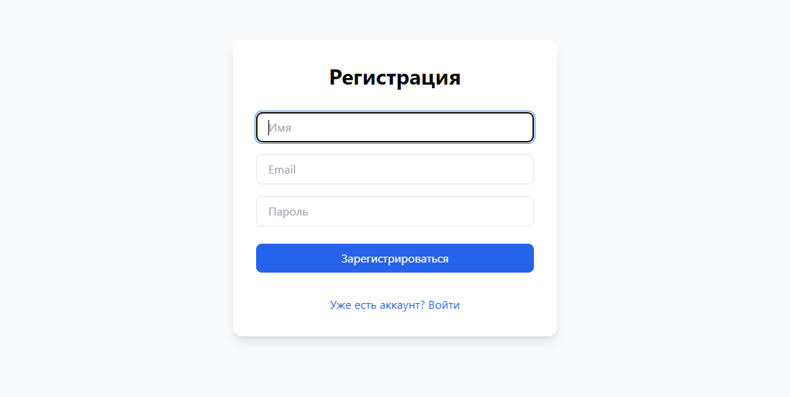
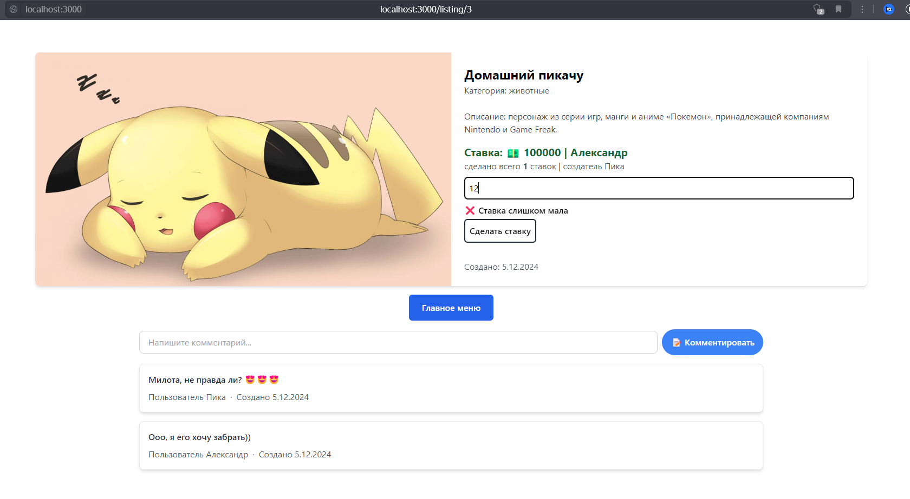
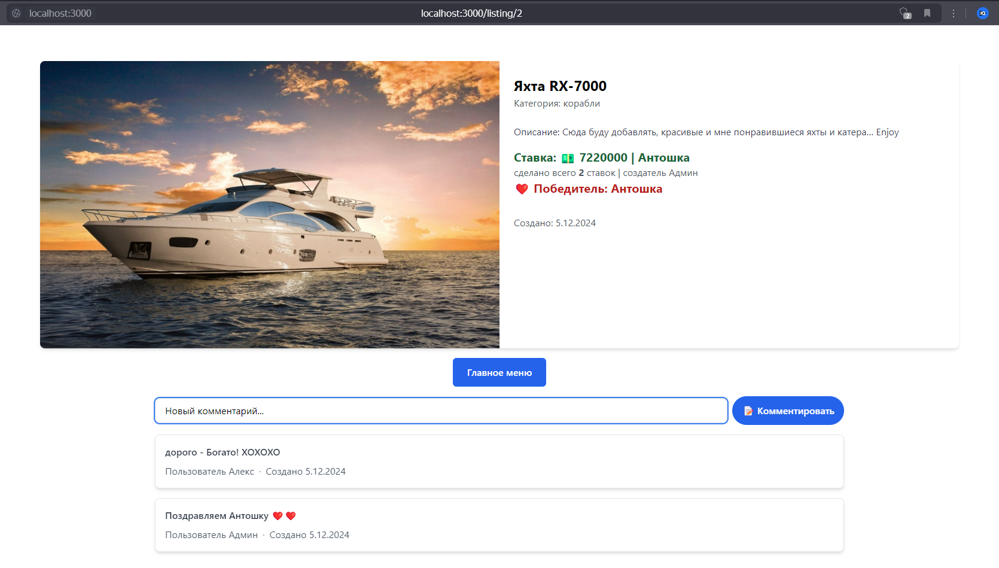
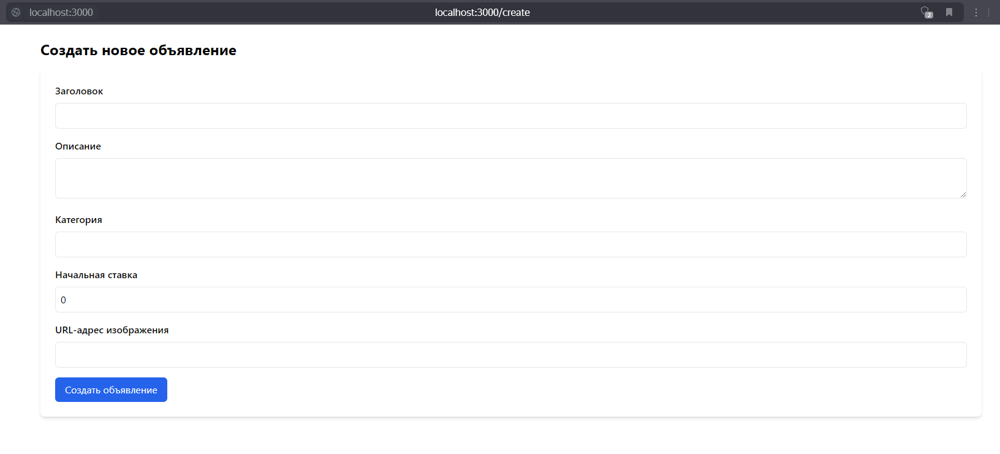

##💲 Аукционная площадка для курсовой:
### 👉 Фото соответствуют реализованному функционалу!
В проекте аукционной площадки был использован современный и мощный стек технологий! Данный проект разрабатывался для курсовой работы вуза, и включает в себя:
- Next.js - фреймворк для React с поддержкой серверных компонентов
- React - библиотека для построения пользовательского интерфейса
- TypeScript - типизированный JavaScript для надежного кода
- Tailwind CSS - утилитарный CSS фреймворк для стилизации
- Prisma - ORM для работы с базой данных
- SQLite - реляционная база данных
- bcrypt - библиотека для хеширования паролей
- Axios - HTTP клиент для запросов к API
- Zustand - менеджер состояний
- ESLint - инструмент для статического анализа кода
- Client-side rendering
- Server-side rendering (SSR)
- API Routes
- Модульная архитектура

